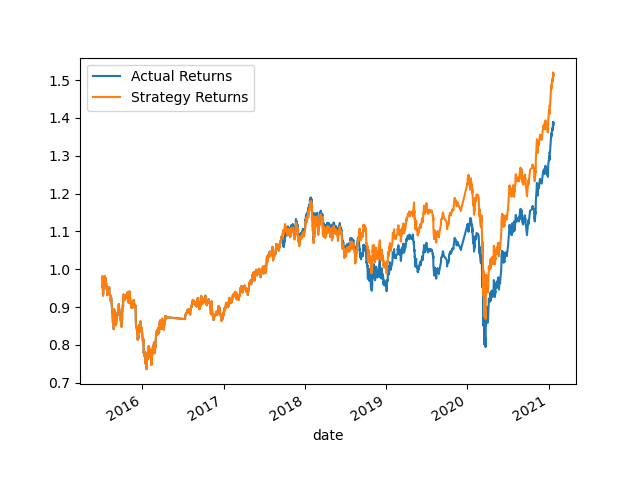
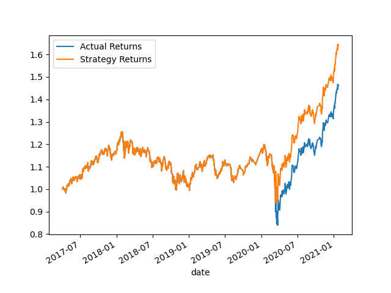
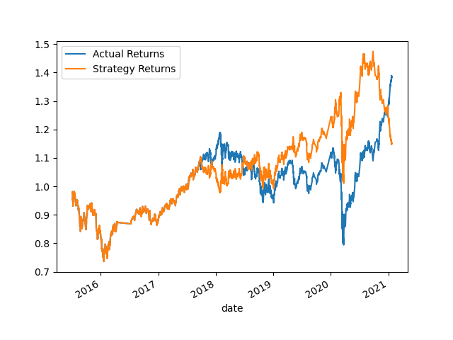

# Module 14 Assignment

## Overview
This assignment delved into the exploration of how adjustments in variable values, such as Simple Moving Average (SMA) parameters, training windows, and other factors, can influence the accuracy and precision of various trading algorithms. The primary focus of this project was to fine-tune these variables and document the resulting classification reports for comparative analysis. Below, a comprehensive overview is provided, highlighting the outcomes and contrasts observed across multiple models:

- __Baseline Model:__
    * Initial trading algorithm used as a reference point.
    * Performance metrics and strategy returns serve as benchmarks for comparison.
- __Model with Different Training Window:__
    * Experimentation with altering the training window duration.
    * Comparative analysis conducted to assess the impact on accuracy, precision, and other performance metrics.
    * Strategy returns evaluated to determine any corresponding variations.
- __Model with Different SMA Values:__
    * Exploration of the influence of varying SMA parameters on algorithm performance.
    * Classification reports generated to quantify changes in accuracy, precision, and other relevant metrics.
    * Examination of strategy returns to gauge the effectiveness of SMA adjustments in enhancing trading outcomes.
- __New Model (Logistic Regression):__
    * Introduction of a new model based on Logistic Regression.
    * Performance metrics assessed to evaluate the new model in comparison to the baseline and other variations.
    * Strategy returns analyzed to ascertain the potential profitability of the Logistic Regression-based approach.

Throughout the analysis, the performance metrics and strategy returns of each model were evaluated and compared. By systematically adjusting key variables and meticulously documenting the resulting outcomes, this project aimed to provide valuable insights into the intricate interplay between algorithmic parameters and trading effectiveness.

## Baseline Model Results

### Summary of the Classification Report:
- For class -1.0:
    * Precision: 0.43
    * Recall: 0.04
    * F1-score: 0.07
- For class 1.0:
    * Precision: 0.56
    * Recall: 0.96
    * F1-score: 0.71
- Accuracy: 0.55
- Macro Average:
    * Precision: 0.49
    * Recall: 0.50
    * F1-score: 0.39
- Weighted Average:
    * Precision: 0.50
    * Recall: 0.55
    * F1-score: 0.43

### Overall Evaluation:
The baseline model achieved moderate performance with an accuracy of 0.55. Precision for class -1.0 was relatively low at 0.43, while recall was even lower at 0.04, indicating difficulty in identifying instances of class -1.0. On the other hand, precision and recall for class 1.0 were higher, indicating better performance in predicting instances of class 1.0. The macro and weighted averages for precision, recall, and F1-score were consistent, albeit at moderate levels.

## Model 2 (Training Window)

_The baseline model's training window was changed to 24 months  instead of 3 months for this model._
### Summary of the Classification Report:
- For class -1.0:
    * Precision: 0.80
    * Recall: 0.00
    * F1-score: 0.01
- For class 1.0:
    * Precision: 0.56
    * Recall: 1.00
    * F1-score: 0.72
- Accuracy: 0.56
- Macro Average:
    * Precision: 0.68
    * Recall: 0.50
    * F1-score: 0.36
- Weighted Average:
    * Precision: 0.67
    * Recall: 0.56
    * F1-score: 0.41
### Overall Evaluation:
The model achieved a moderate performance with an accuracy of 0.56. The precision for class -1.0 is relatively high at 0.80, but the recall is very low at 0.00, indicating that the model struggles to correctly identify instances of class -1.0. This is reflected in the low F1-score of 0.01 for class -1.0. On the other hand, the precision, recall, and F1-score for class 1.0 are relatively high at 0.56, 1.00, and 0.72 respectively, indicating better performance in predicting instances of class 1.0. The macro and weighted averages for precision, recall, and F1-score are 0.68, 0.50, and 0.36 respectively, indicating a relatively consistent performance across classes, albeit with a significant imbalance between the classes._

### __Impact from increasing the training window:__
Model 2 achieved moderate performance with an accuracy of 0.56. Precision for class -1.0 increased significantly to 0.80, but recall dropped to 0.00, indicating challenges in correctly identifying instances of class -1.0. Precision, recall, and F1-score for class 1.0 remained relatively high. However, the macro and weighted averages for precision, recall, and F1-score decreased compared to the baseline model, indicating a trade-off between precision and F1-score. Increasing the training window led to improvements in precision for class -1.0 but resulted in a significant decrease in recall and F1-score for both macro and weighted averages.

## Model 3 (SMA): 

_While keeping the updated training window of 24 months, the SMA's were changed from 4(short) and 100(long) to 5(short) and 200(long)._
### Summary of the Classification Report:
- For class -1.0:
    * Precision: 0.48
    * Recall: 0.27
    * F1-score: 0.34
-  For class 1.0:
    * Precision: 0.57
    * Recall: 0.77
    * F1-score: 0.66
- Accuracy: 0.55
- Macro Average:
    * Precision: 0.53
    * Recall: 0.52
    * F1-score: 0.50
- Weighted Average:
    * Precision: 0.53
    * Recall: 0.55
    * F1-score: 0.52
### Overall Evaluation:
The model achieved a moderate performance with an accuracy of 0.55. The precision, recall, and F1-score for class -1.0 are relatively lower compared to class 1.0, indicating that the model has difficulty correctly identifying instances of class -1.0. The macro and weighted averages for precision, recall, and F1-score are around 0.53, 0.52, and 0.50 respectively, indicating a relatively balanced performance across classes, although slightly skewed towards class 1.0._

### __Impact from increasing both of the SMA windows:__

Changing the SMA windows led to a decrease in precision for class -1.0 and a decrease in F1-score for both macro and weighted averages. However, recall for class -1.0 increased, indicating a slight improvement in identifying instances of class -1.0. There is also a significant increase in Strategy returns.

## Performance Evaluation of SVC models:

In conclusion, Model 3 actually showed highest returns, but overall a lower accuracy and precision. It is interesting that we can see that Model 2(Training Window) has the highest accuracy and weighted average F1-score. So it is important to note that different models will fit different scenarios. In another case Model 2 may be more attractive due to higher accuracy. But in this specific scenario, Model 3 appears to be the best among the three models, providing the best returns for the investor. 

*Here is a visualization of Actual Returns vs Strategy Returns of __Model 3__, or the edited SMA lengths model. You can clearly see the higher strategy returns*

## Logistic Regression Model Results

### Summary of the Classification Report:
- For class -1.0:
    * Precision: 0.48
    * Recall: 0.27
    * F1-score: 0.34
-  For class 1.0:
    * Precision: 0.57
    * Recall: 0.77
    * F1-score: 0.66
- Accuracy: 0.55
- Macro Average:
    * Precision: 0.53
    * Recall: 0.52
    * F1-score: 0.50
- Weighted Average:
    * Precision: 0.53
    * Recall: 0.55
    * F1-score: 0.52

_Overall, the model achieves a moderate performance with an accuracy of 0.55. The precision, recall, and F1-score for class -1.0 are relatively lower compared to class 1.0, indicating that the model has difficulty correctly identifying instances of class -1.0. The macro and weighted averages for precision, recall, and F1-score are around 0.53, 0.52, and 0.50 respectively, indicating a relatively balanced performance across classes, although slightly skewed towards class 1.0._

### __How the LogisticRegression Model compared to the Baseline Model:__
---
The LogisticRegression model has higher precision, recall, and F1-score for class -1.0 when compared to the baseline model, indicating better performance in identifying instances of class -1.0. The LogisticRegression model also has slightly higher precision for class 1.0, while recall and F1-score are slightly lower compared to the baseline model. The returns of the LogisticRegression model were also lower than the strategy returns of the initial baseline model.

Overall, the LogisticRegression model has a higher macro average and weighted average F1-score, indicating better overall performance compared to the baseline model. While when comparing performance metrics, the LogicticRegression model is the best choice, but for the purpose of this project, higher returns are more attrative. Therefore, the baseline model would be the choice in this scenario.

## Conclusion

Although Model 3 had lower accuracy and precision compared to Model 2 (Training Window) and the logistic regression model, it demonstrated higher returns. Therefore, when the primary objective is to maximize returns, Model 3 (SMA) can be considered the best option despite its lower performance in other metrics. 
